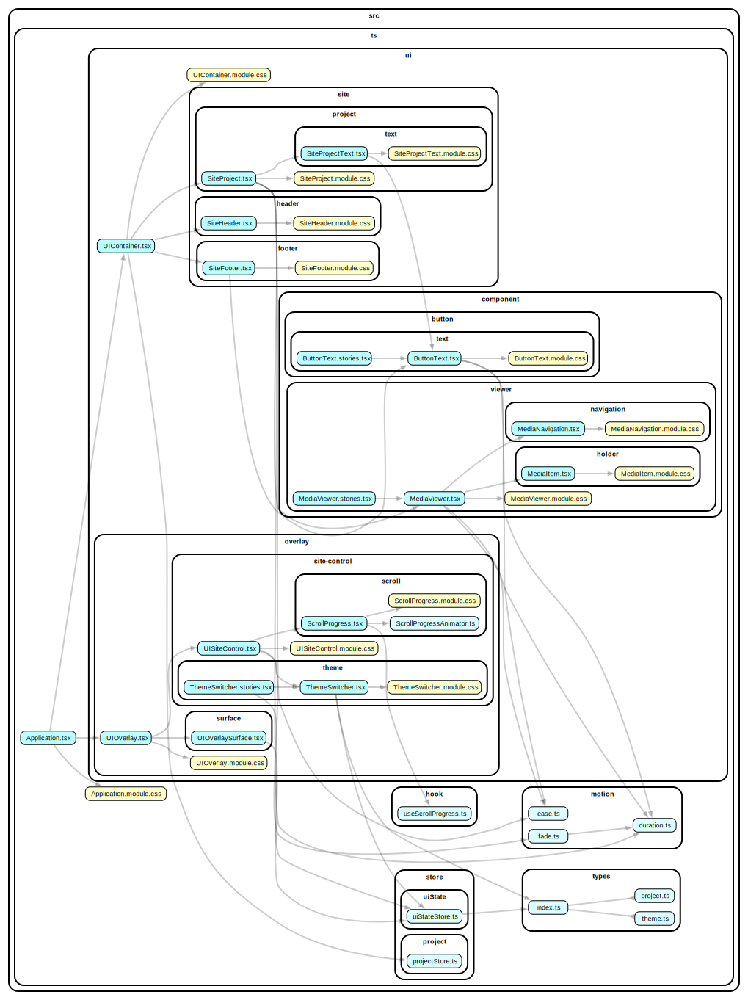

### Portfolio Barnaby Sheeran

Vite - React - Typescript (strict) - Zustand - CSS Modules  
  
Work in Progress  

### _

`npm install` - Installs dependancies - tested: node 22.20.0 npm 11.6.1  

`npm run preview` - Starts Vite preview  
`npm run dev` - Starts Vite development server  
`npm run lint` - Lints by tsc, eslint, & stylelint in series  
`npm run build` - Builds project to /dist  

`npm run storybook` - Starts storybook development server  
`npm run build-storybook` - builds storybook to /storybook-static  

`npm run todo` - Lists TODO in /src  

### _

`npm run depcruise` - Updates tool/depcruise/dependencygraph.svg (requires GraphViz `dot`)  

